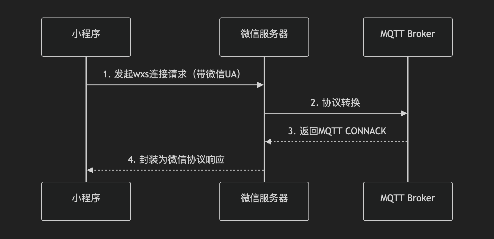
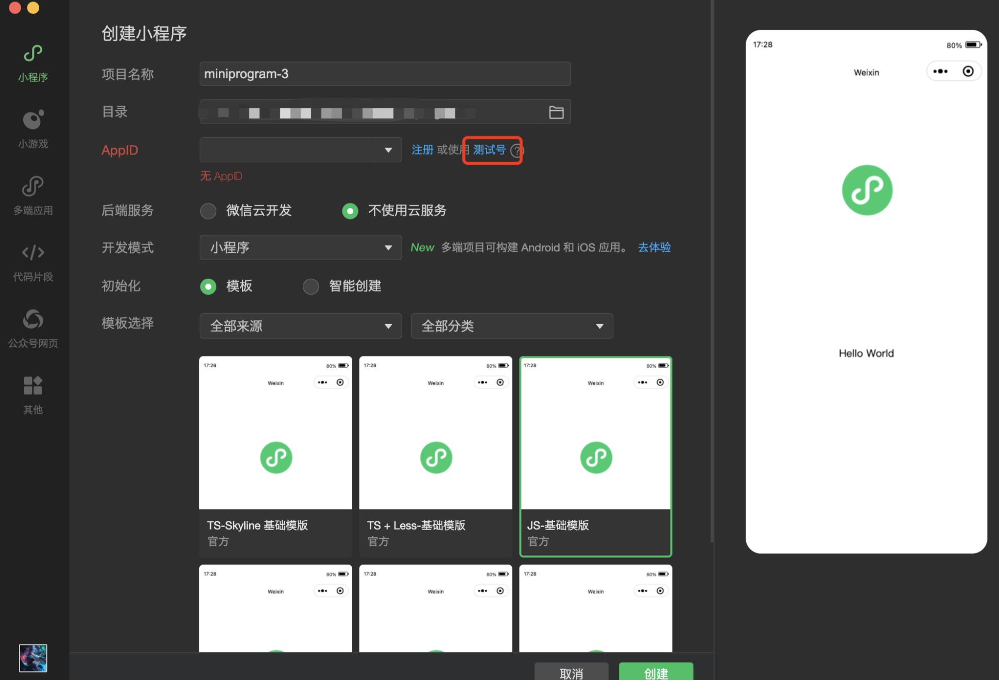
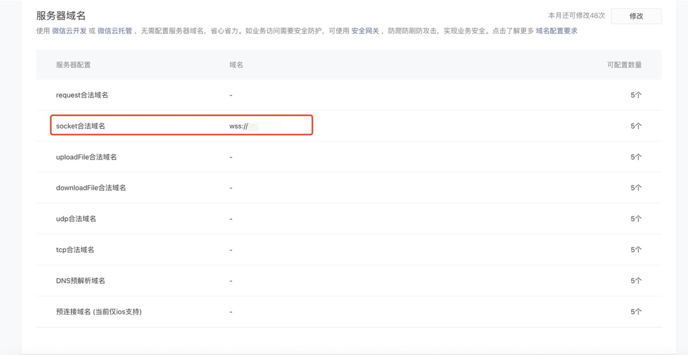
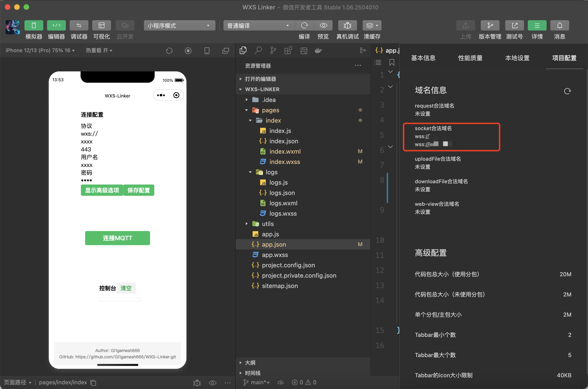
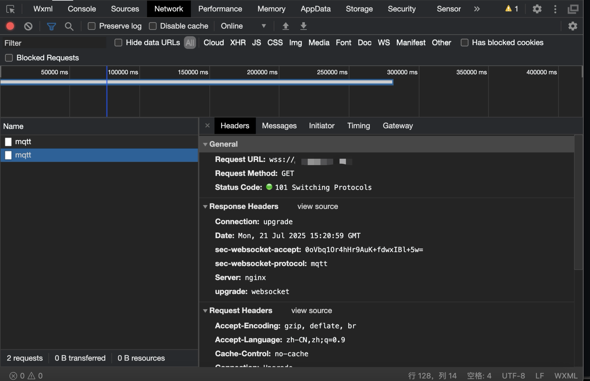

# WXS-Linker
Link to MQTT by WXS Protocol

###### 最近在一次漏洞挖掘的时候，遇到了微信小程序里面使用wxs协议来连接MQTT服务，在微信小程序中，​必须使用 wxs:// 协议 进行 MQTT 连接，这是微信生态的强制要求，wxs协议是微信的私有协议，配微信SDK，形成安全性依赖微信闭环体系。如果目标MQTT服务强制验证微信的私有请求的话，平常的连接工具可能就不太好用了，所以我写了一个工具，用来测试这种情况下的MQTT连接。

相比于原版的MQTT的C/S架构通信，WXS协议在中间加了一层，使用微信服务器来对服务端发起请求返回给客户端


因此就会导致报文结构差异:
wxs:// 特有字段
```：
  GET /mqtt HTTP/1.1
  Host: jsygt.com
  X-WX-Client: miniprogramX-WX-Protocol: wxs
  ```
wss:// 标准字段
```
  GET /mqtt HTTP/1.1Upgrade: websocket
  Connection: Upgrade
  Sec-WebSocket-Key: dGhlIHNhbXBsZSBub25jZQ==
 ```
因为WXS协议带有私有字段，而且微信服务的 TLS 证书包含扩展字段：
```  
X509v3 extensions:
  X509v3 Subject Alternative Name:
    DNS:*.wx.qq.com, DNS:*.wechat.com
  ```
如果在服务端有校验这些内容的话，非微信客户端的SNI（Server Name Indication）无法通过验证。


### ⚠️注意：建议只在本地开发环境下使用，以免敏感信息泄漏！

##  环境搭建
需要使用`微信开发者工具`来运行该项目
- 下载链接：https://developers.weixin.qq.com/miniprogram/dev/devtools/download.html

新建一个项目  
如果没有注册，可以直接使用测试号


其次要在微信开发者平台添加服务器socket域名白名单，不然不能访问，会被微信限制
https://mp.weixin.qq.com/


配置好后，刷新项目配置就能看到socket白名单


如果连接参数无误，连接后可以在控制台中看到wxs请求
